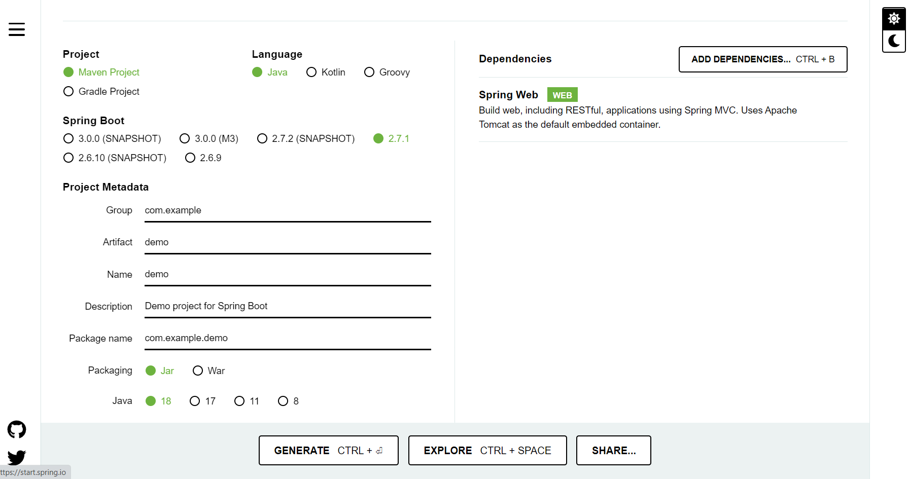
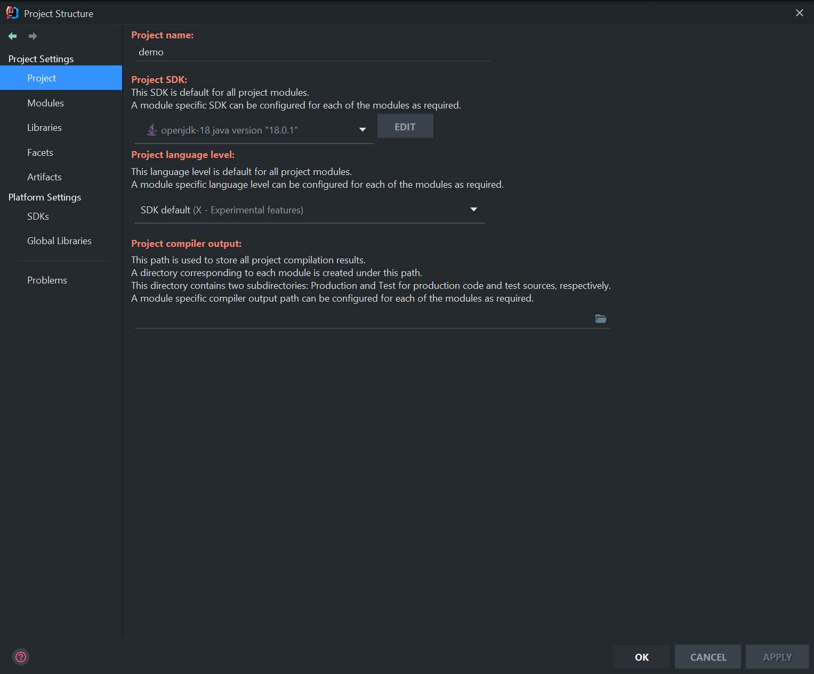
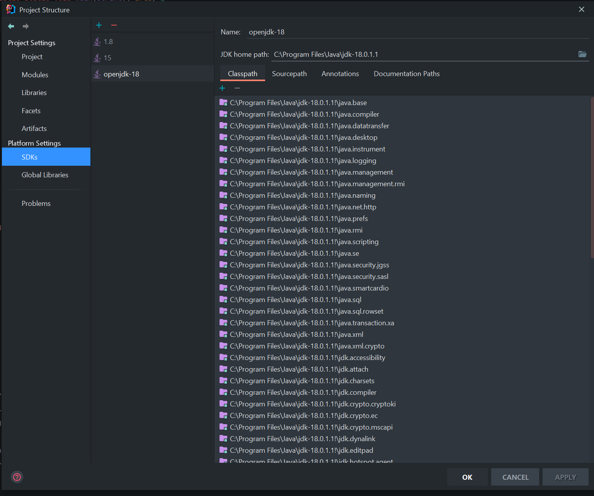
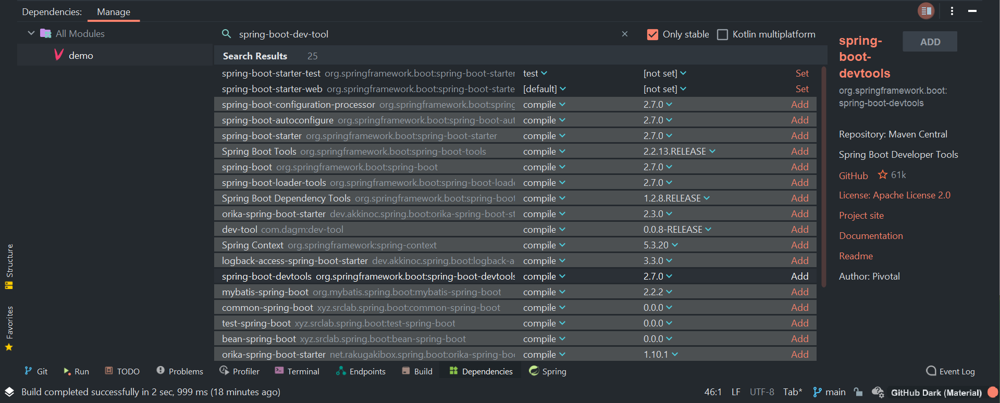
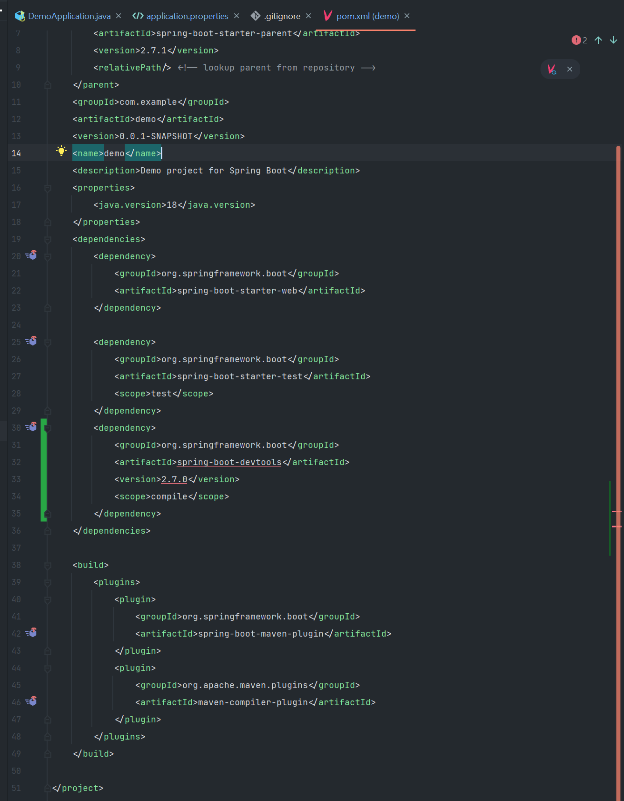
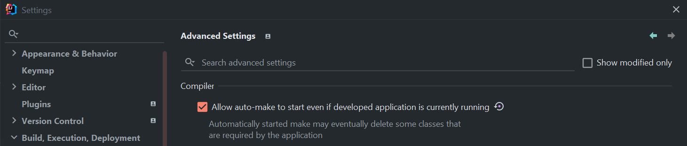
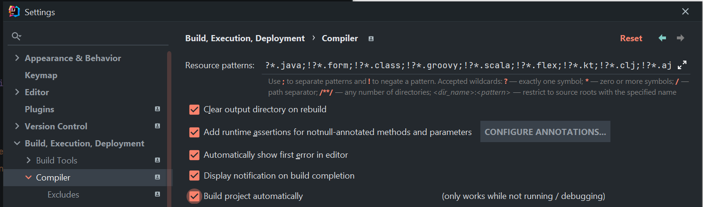

# Spring Boot Application
A Spring Boot app with Java 18.

## Spring Boot Setup
### Using Initializr
1. Generate the boilerplate:
   - [Spring Initializr](https://start.spring.io/)
   - Basic Java-Maven project with Java 18 (`Spring Web` dependency is required)
   


2. Start a new project with the generated file and set `Project SDK` (e.g. 18 - if it is the latest Java version, 
you will need to download the JDK-18, and set all the project with it and the SDK with X-Experimental):

   
   

    **NOTE**: You can download the latest JDK version from [Oracle](https://www.oracle.com/java/technologies/downloads/#jdk18-windows)
    and set the environment variable with the new Java path, e.g. `C:\Program Files\Java\jdk-18.0.1.1\bin` (remember to 
    delete any existing Java path). `$ java --version`

3. Set your IntelliJ to _reload on save_:

   - Add _Spring Boot Devtools_:
   
   
   - Reload the Maven dependencies (icon on the top right)
   
   
   - Allow auto-reload on server changes:
     - In Advanced Settings > `Allow auto make...`
     
     - And tick also the Compiler `Build project automatically`
     

### From Scratch
[Spring Boot reference](https://docs.spring.io/spring-boot/docs/current/reference/html/) \
[Getting Started](https://docs.spring.io/spring-boot/docs/current/reference/html/getting-started.html#getting-started)

1. Install any missing local dependency like [Maven](https://maven.apache.org/download.cgi). You can download the 
`Binary zip archive` and unzip it in your `Program Files`, and finally add a new environment variable under `Path`, 
e.g. `C:\Program Files\apache-maven-3.8.6\bin`. `$ mvn -v`

2. At this point, you should have only the `.gitignore` in your project folder. 
   - Copy the basic `pom.xml` from the [reference](https://docs.spring.io/spring-boot/docs/current/reference/html/getting-started.html#getting-started.first-application.pom)
   - Run: 
     - `$ mvn package` to detects the Maven and gives you a working build 
     - `$ mvn dependency:tree` to check the pom file and install any dependency, what it is only `com.example:myproject:jar:0.0.1-SNAPSHOT`
   - Add the recommended dependencies and re-run the last command to install them

3. Create the main Java file `src/main/java/MyApplication.java` with the SpringBoot syntax and run `$ mvn spring-boot:run`

4. Create a completely self-contained executable **Jar** that we could run in production
   - Add the required plugins to the `pom.xml`
       ```xml
          <build>
              <plugins>
                  <plugin>
                      <groupId>org.springframework.boot</groupId>
                      <artifactId>spring-boot-maven-plugin</artifactId>
                  </plugin>
              </plugins>
          </build>
       ```
   - Click again the Maven button; run `$ mvn package`; and finally `$ java -jar ./target/myproject-0.0.1-SNAPSHOT.jar`

## RESTful API
1. Create a package called `Customer` and a Spring Application (`@SpringBootApplication`): 
   - Right button over `java` folder -> New > Package -> `Customer`
- Right button over `Customer` package ->  New > Java Class -> `CustomerApplication`. This must include the annotation 
`@SpringBootApplication`

2. Create a `Customer` class with getters and setters for `name` and `email`

3. Create a customer controller:
   - Right button over `Customer` package ->  New > Java Class -> `CustomerController`. This must include the `@RestController`

4. Use **JPA** (_Java Persistence API_) dependency: `spring-boot-starter-data-jpa` (search for it under `Dependencies`)
    - Install JPA dependency through IntelliJ Dependencies section `spring-boot-starter-data-jpa`
    - Add the annotation `@Entity` to the `Customer` class
    - Add a `@PostMapping` in the `CustomerController`, what will require a `CustomerRepository` **interface** `<EntityType, EntityID>`
    - Create a _constructor_ in the `CustomerController` to inject the previous `CustomerRepository` to be able to use 
    all the available methods (`dependency injection`) like `.save()`
    - Add a DB dependency in the `pom.xml` file, e.g. `H2` can be found using the _initializr_: ADD DEPENDENCIES > H2 Database
   ```xml
    <dependency>
      <groupId>com.h2database</groupId>
      <artifactId>h2</artifactId>
      <scope>runtime</scope>
    </dependency> 
   ```
   - Add the annotations `@Id @GeneratedValue` in the `Customer Entity` for the `id` to provide the type `Id` and autogenerate 
   a new one every time; Also do not forget to create a default `Customer` constructor for the same entity
   - _POST_ request example:
   ```json
    {
      "name": "Manu",
      "email": "manukempo@gmail.com"
    }
    ```